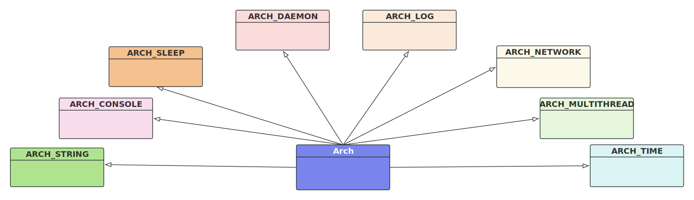

# 1. Arch
首先，极简的说，DeskFlow的跨平台抽象层如下(先忽略类成员)： 


# 2. Arch类设计
Arch类是单例类，他们这个单例有点问题，但是人家确实是这么设计的。
## 2.1. Arch类声明   
```cpp
// arch.h
class Arch : public ARCH_CONSOLE,
             public ARCH_DAEMON,
             public ARCH_LOG,
             public ARCH_MULTITHREAD,
             public ARCH_NETWORK,
             public ARCH_SLEEP,
             public ARCH_STRING,
             public ARCH_TIME
{
public:
// 构造函数是public的，但是没有问题，后面会分析
  Arch();              
  Arch(Arch *arch);
  virtual ~Arch();

  virtual void init();

  static Arch *getInstance();

  static void setInstance(Arch *s)
  {
    s_instance = s;
  }

private:
  static Arch *s_instance;     //静态私有单例
};
```
## 2.2. Arch类实现
```c++
Arch *Arch::s_instance = NULL;  // 俄汉模式，初始化静态私有单例
```
## 2.3. 单例构造
```c++
Arch::Arch()
{
  assert(s_instance == NULL);   // 只能创建一个Arch对象
  s_instance = this;
}

// 危险的代理构造，实际并没有使用
Arch::Arch(Arch *arch)
{
  s_instance = arch;           // 允许外部接管实例
}

Arch::~Arch()
{
}
```
在DeskFlow软件中，不管是Clinet还是Server，都只在程序启动时创建一个Arch对象，无他，代码也是仅在DeskFlow工程内部使用，所以就是public也不影响。

## 2.4. 单例初始化
```c++
void Arch::init()
{
  ARCH_NETWORK::init();
#if SYSAPI_WIN32
  ArchMiscWindows::init();
#endif
}
```

## 2.5. 单例访问
```cpp
Arch *Arch::getInstance()
{
  assert(s_instance != NULL);
  return s_instance;
}
```

# 3. 单例使用
```cpp
  Arch arch;
  arch.init();
```
