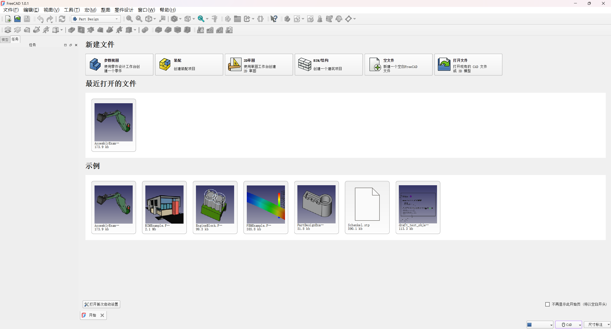

# FreeCAD - 1.0.1
https://github.com/FreeCAD/FreeCAD  
下面是freecad的多个realease版本介绍:      
**Windows平台**：    
```bash
FreeCAD_1.0.1-conda-Windows-x86_64-installer-1.exe
FreeCAD_1.0.1-conda-Windows-x86_64-installer-1.exe-SHA256.txt
FreeCAD_1.0.1-conda-Windows-x86_64-py311.7z                           # 便携式
FreeCAD_1.0.1-conda-Windows-x86_64-py311.7z-SHA256.txt
```
其中conda表示该版本基于 Conda 包管理器构建，py311表示依赖Python-3.11。    

**Linux平台**：    
```bash
FreeCAD_1.0.1-conda-Linux-x86_64-py311.AppImage
FreeCAD_1.0.1-conda-Linux-x86_64-py311.AppImage-SHA256.txt
FreeCAD_1.0.1-conda-Linux-x86_64-py311.AppImage.zsync
```
# 安装
以Windows平台为例：    
下载FreeCAD_1.0.1-conda-Windows-x86_64-py311.7z，解压后，FreeCAD_1.0.1\bin\freecad.exe就是可执行文件。    

